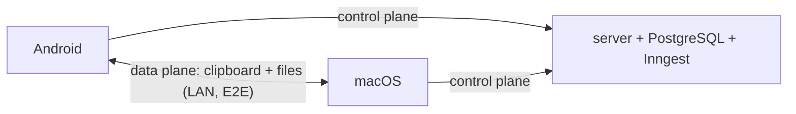

# FuseOS — High-Level Design (HLD)

**Version:** v2.0
**Status:** Approved for build
**Scope:** Authentication, device linking, clipboard sync, file transfer

> **Note on v1 docs:** the earlier HLD described a "local-first, backend optional" system while the earlier LLD described "the backend is always the coordinator." Those contradicted each other. This document supersedes both and defines the single agreed architecture: a **hybrid** system with a cloud control plane and a LAN data plane. See §2.

---

## 1. Purpose & scope

FuseOS establishes a secure, low-latency bridge between **Android** and **macOS** devices under one user account. v1 delivers: secure authentication, automatic device linking, real-time clipboard sync (text + images), and file transfer. Screen mirroring, remote control, and call/SMS relay are explicitly out of scope for v1.

## 2. Architecture: control plane vs. data plane

FuseOS is **hybrid**. Two planes, kept strictly separate:

- **Control plane (cloud).** The `server/` (Node 22 + TypeScript + Fastify) plus PostgreSQL. Responsible for identity, the device registry, trust, presence, and **signaling** (helping two devices discover each other's LAN address). This is the **only** component that touches the database.
- **Data plane (LAN).** A **direct, encrypted, device-to-device connection over the local network**. All clipboard content and file bytes travel here. **Payloads never pass through the server and are never stored in the database.**

The server's job on the data path is limited to *introductions*: it tells device A how to reach device B on the LAN, then gets out of the way.

### Design principles
- Local-network-first for the data path; the server is never on the payload hot path.
- Event-driven, persistent connections; no polling.
- The database is the source of truth for identity/device/trust state — nothing else.
- Trust follows the account and is revocable by signing a device out.

## 3. Components

### 3.1 Android client (Kotlin + Jetpack Compose)
- Authenticates against the control plane; registers the device.
- Monitors and injects the system clipboard (`ClipboardManager`).
- Discovers peers on the LAN via NSD (mDNS) and maintains the direct data-plane connection (foreground service for reliability).
- Sends/receives files via the Storage Access Framework.

### 3.2 macOS client (SwiftUI)
- Authenticates and registers the device.
- Monitors and injects the clipboard (`NSPasteboard`).
- Discovers peers via Bonjour / `Network.framework` and maintains the direct data-plane connection.
- Provides a Share extension ("Send to my phone").

### 3.3 Server / control plane (Node 22 + TypeScript + Fastify)
- **Auth** via Better Auth (email/password; one bearer session token for REST + WebSocket).
- **Device registry** in PostgreSQL (Drizzle ORM). Trust is derived from it, not stored separately.
- **WebSocket `/signal`**: presence + LAN-address signaling.
- **Inngest** for durable async work (presence-timeout sweeps, email verification).
- Handles **no clipboard or file payloads**.

### 3.4 PostgreSQL
- Source of truth for users and their devices. Trust needs no rows of its own — it is same-account membership.
- Integrity enforced by schema constraints (see [schema.md](schema.md)).

## 4. Authentication & identity

- **User auth:** one FuseOS account; Better Auth issues a session whose token authorizes both REST calls and the `/signal` WebSocket. Each device authenticates independently.
- **Device identity:** on registration each device is assigned a unique device id and generates a device key pair. The public key is stored in the registry; the private key never leaves the device. Device identity is persistent and bound to the user account.

## 5. Trust

**Two devices are trusted because they are on the same account.** Both proved who they are
at sign-in, and FuseOS links one user's own devices by design, so a separate pairing step
would ask the user to prove a second time what the login already established.

1. The user installs the app on the second device and signs in with the same account.
2. It registers (device id + public key) and opens `/signal`.
3. The control plane hands each side the other's peer card — public key and LAN address.
4. The devices open the data-plane channel directly. No code, no scan, no confirmation.

If step 3 never happens — a dropped socket, stale presence — a **manual link code** is the
fallback: one device shows a short code (or a QR), the other types or scans it, and the
control plane forces the same peer-card exchange. It grants no trust it did not already
have; it only makes the introduction happen now instead of eventually.

Trust is revoked by signing the device out (or deleting it from the registry): it stops
appearing as a peer, and the data-plane connection is torn down.

## 6. Connectivity model

- **Discovery:** mDNS/Bonjour on the LAN (`_fuseos._tcp`), assisted by control-plane signaling that supplies the peer's current LAN address and presence.
- **Connection:** persistent, bidirectional, **end-to-end encrypted** (TLS/DTLS) directly between the two devices.
- **Lifecycle:** discover → authenticate peer (device keys) → establish secure channel → maintain with heartbeats → auto-reconnect on network change.
- **Off-LAN:** out of scope for v1; a future encrypted relay fallback is noted in the roadmap, not built.

## 7. Clipboard synchronization (core feature)

- **Supported data (v1):** plain text and images.
- **Capture:** both clients watch the local clipboard; only **user-initiated** changes propagate.
- **Flow:** change on A → serialized (protobuf) + encrypted → sent over the data-plane channel → B validates source → B updates its clipboard → ACK.
- **Loop prevention:** every event carries a `source_device_id` + monotonic sequence; a receiver **applies but never re-emits**; conflicts resolve last-write-wins. (See [protocol.md](protocol.md).)

## 8. File transfer

- File is described by a `FILE_META` message, then streamed as ordered `FILE_CHUNK` messages over the data-plane channel, with integrity verification and progress. Files never touch the server.

## 9. Latency

- Persistent connections avoid repeated handshakes; events are lightweight and push-based; no polling. The control plane is never in the payload path. Target: p95 clipboard sync < 300 ms on a healthy LAN.

## 10. Failure handling

- Temporary disconnects trigger automatic reconnection; sync pauses gracefully and resumes.
- No indefinite queuing of clipboard events.
- Control-plane calls fail loud (typed errors); data-plane drops fail soft (degrade + reconnect, never crash).
- Presence timeouts are swept by an Inngest job so stale "online" state self-heals.

## 11. Security

- End-to-end encryption on the LAN channel (TLS/DTLS); session keys per connection.
- Session-token auth on every control-plane request and WebSocket connection.
- Message authentication / integrity on data-plane messages.
- Payloads never persisted server-side → minimal data exposure.

## 12. Success criteria

FuseOS v1 succeeds if devices link reliably, connections stay stable, clipboard sync is fast and consistent, file transfer works both ways, and trust is always account-scoped and revocable — with **zero payload data ever on the server**.
