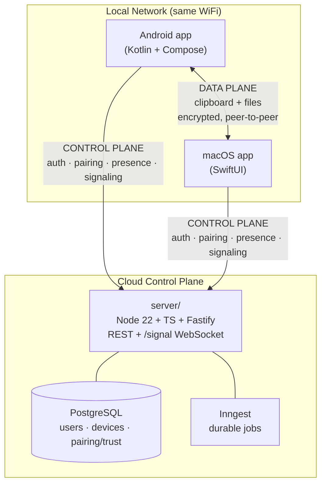

# FuseOS — Product Requirements Document (PRD)

**Version:** v1.0
**Status:** Approved for build
**Scope:** Authentication, device pairing, clipboard sync, file transfer, share-sheet send

---

## 1. Problem

A person's day spans a phone and a laptop, but an **Android phone and a Mac do not talk to each other**. Apple gives iPhone + Mac users seamless continuity — universal clipboard, AirDrop, Handoff — and there is no equivalent for the Android ⇄ macOS combination that millions of people actually use.

The result is constant friction: to move a link, a snippet, a screenshot, or a small file from phone to Mac (or back), users email themselves, message themselves, or reach for a third-party tool. Every transfer is a context switch and a few seconds of lost focus, many times a day.

## 2. Product vision

**FuseOS makes an Android phone and a Mac behave like one system.** Copy here, paste there. Share to the other device from the native share sheet. Send a file in a tap. It should feel instant and require no thought — the way Apple's ecosystem does, but across the Android/macOS boundary.

## 3. Goals & non-goals

### Goals (v1)
- One account, same login on both the Android and macOS apps.
- Pair 2–3 of a user's own devices securely.
- Real-time **clipboard sync** of text and images.
- **File transfer** both directions.
- **Share-sheet** integration: "Send to my Mac / my phone."
- Feel **instant** on a shared local network.

### Non-goals (v1, explicitly deferred)
- Screen mirroring (either direction).
- Remote control of one device from another.
- Phone-call answering and SMS/notification relay.
- Cloud clipboard history or storage of user payloads.
- Cross-network sync when devices are **not** on the same LAN (a future relay fallback is noted, not built).
- Windows / iOS / Linux clients (later platforms).

These are deferred deliberately to keep v1 focused, shippable, and honest about what the local-first transport can guarantee. They are a **later phase**, and some (call/SMS relay) carry hard OS restrictions that need their own design.

## 4. Target users

- Developers and professionals on a **Mac laptop + Android phone**.
- Students moving content between a phone and a laptop.
- Power users who switch devices constantly and feel every transfer of friction.

## 5. Platform matrix

| Platform | v1 | Tech | Notes |
| --- | --- | --- | --- |
| Android | ✅ | Kotlin + Jetpack Compose | Clipboard, foreground service, mDNS (NSD), Storage Access Framework |
| macOS | ✅ | SwiftUI | `NSPasteboard`, `Network.framework`/Bonjour, Share extension |
| iOS | ❌ later | Swift | Sandbox restricts background clipboard/mirroring |
| Windows | ❌ later | TBD | |

## 6. Core user journeys (v1)

1. **Sign up / sign in** — the user creates a FuseOS account (email + password) and signs in on each device. Each device registers itself under the account.
2. **Pair devices** — on device A the user starts pairing and gets a short-lived code; on device B they enter the code. The devices exchange keys and establish trust. Trusted devices reconnect automatically thereafter.
3. **Clipboard sync** — the user copies text or an image on the phone; within a moment it is on the Mac's clipboard (and vice versa). Only user-initiated copies propagate; received content is not re-broadcast.
4. **File transfer** — the user picks a file and sends it to the paired device; it arrives and is saved / offered to save.
5. **Share-sheet send** — from any app's native share sheet, the user picks "Send to my Mac / my phone" and the content lands on the other device.

## 7. Requirements

### Functional
- Account creation, login, session refresh, and logout.
- Device registration, listing, and revocation.
- Pairing via short-lived, one-time, user-scoped code; device public-key exchange; persisted trust.
- Real-time presence: each device knows which of the user's other devices are online.
- Clipboard capture (text + image) and injection on both platforms, user-initiated only.
- Chunked file transfer with integrity verification and progress.
- Share-sheet entry points on both platforms.
- Loop prevention: received clipboard content is never re-emitted.

### Non-functional
- **Latency first.** Clipboard sync must feel instantaneous on a healthy LAN. The control plane is never on the payload path.
- **Privacy.** Clipboard/file payloads travel directly between devices, encrypted, and are never stored on the server or in the database.
- **Integrity.** Account/device/pairing state is authoritative in PostgreSQL and protected by schema constraints.
- **Reliability.** Durable background work (pairing notifications, code expiry, presence timeouts) must not be silently lost.
- **Graceful failure.** Disconnects trigger automatic reconnection; sync pauses cleanly and resumes; no indefinite queuing of clipboard events.

## 8. Architecture overview

FuseOS separates a cloud **control plane** from a LAN **data plane**. The control plane does identity, pairing, and signaling; the data plane carries the actual clipboard and file payloads **directly between devices over the local network**. Payloads never transit the server or the database.

**Read the diagram as two independent paths.** The vertical arrows to `server` are the control plane: login, device registry, pairing, presence, and LAN-address signaling. The horizontal arrow between the apps is the data plane: the real clipboard and file bytes, moving directly device-to-device. The server helps the two devices *find* each other; it never carries what they *send* each other.

Full detail: [HLD](HLD.md) · [LLD](LLD.md) · [schema](schema.md) · [API](api.md) · [protocol](protocol.md).

## 9. Success metrics

- **p95 clipboard-sync latency < 300 ms** on a healthy shared LAN (copy on A → available on B).
- **Pairing success rate > 99%** for devices on the same network.
- **Reconnect after network blip < 3 s**, with no user action.
- **Zero payload bytes** observed on the server / in the DB (privacy invariant, verified by design + audit).
- Retention signal: users keep both apps installed and paired after week 1.

## 10. Roadmap (post-v1)

1. Screen mirroring (phone → Mac first).
2. Remote control / interact with the phone from the Mac.
3. Call and SMS/notification relay (subject to OS constraints).
4. Off-LAN operation via an encrypted relay fallback.
5. Additional platforms (iOS, Windows).
