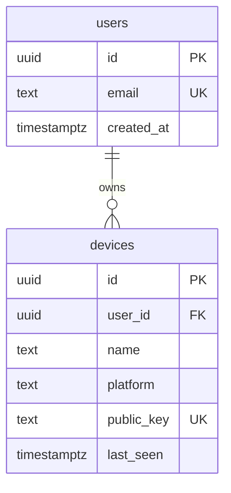

# FuseOS — Database Schema

**Engine:** PostgreSQL · **ORM:** Drizzle · **Auth tables:** Better Auth

The database is the **source of truth for identity only** — users and their devices. It **never** stores clipboard or file payloads; those are ephemeral and LAN-only. Integrity is enforced in the schema itself (NOT NULL, FK, UNIQUE, CHECK) so bad data cannot land even if application code has a bug.

Design goals: deliberate up-front modeling, additive/backward-compatible migrations only, constraints over conventions.

---

## Entity overview

## Tables

### `users` (+ Better Auth tables)
User identity is owned by **Better Auth**, which manages its own tables in our Postgres (typically `user`, `account`, `session`, `verification`). We do **not** hand-roll password storage — Better Auth owns credentials, sessions, and JWT issuance. FuseOS-specific tables below reference the Better Auth user id.

| Column | Type | Constraints |
| --- | --- | --- |
| `id` | uuid | PK |
| `email` | text | NOT NULL, UNIQUE |
| `created_at` | timestamptz | NOT NULL, default `now()` |

> **Dev stand-in — `dev_auth_users` / `dev_auth_sessions`.** Until Better Auth is
> wired, the dev-auth login (`server/src/auth/dev-auth.ts`) persists accounts in a
> `dev_auth_users` table (`id`, `email` UNIQUE, `name` NOT NULL + length CHECK,
> `password_salt`, `password_hash`, `created_at`) and issues opaque bearer tokens
> stored in `dev_auth_sessions` (`token` PK → `user_id`). Both are defined in
> `server/src/db/schema.ts` and are **temporary** — dropped once Better Auth owns
> credentials, sessions, and JWTs.
>
> For the same reason, the `devices` table below currently FKs to
> `dev_auth_users(id)` (not a real `users` table yet); the FK target moves to the
> Better Auth user id when it lands.

### `devices`
One row per registered device. A user has 2–3 in v1.

| Column | Type | Constraints |
| --- | --- | --- |
| `id` | uuid | PK, default `gen_random_uuid()` |
| `user_id` | uuid | NOT NULL, FK → users(id) ON DELETE CASCADE |
| `name` | text | NOT NULL, CHECK (`length(name) between 1 and 100`) |
| `platform` | text | NOT NULL, CHECK (`platform in ('android','macos')`) |
| `public_key` | text | NOT NULL, UNIQUE |
| `battery` | int | nullable, CHECK (`battery is null or battery between 0 and 100`) — presence metadata, never payload |
| `last_seen` | timestamptz | nullable |
| `created_at` | timestamptz | NOT NULL, default `now()` |

Indexes: `(user_id)` for registry listing.

## What is deliberately NOT here

- **No `device_trust` table and no `pairing_codes` table.** Two devices are trusted
  because they share a `user_id` — the sign-in already established that, so there is
  nothing to persist at link time and no code to issue or expire. `trustedPeerIds`
  (`server/src/devices/trust.ts`) is the whole of it. Both tables existed until migration
  `0002`, which drops them.
- **No `clipboard_events` table. No `files` table.** Clipboard content and files are ephemeral and travel LAN-direct (see [protocol.md](protocol.md)). Storing them would violate the latency and privacy invariants and put user payloads in the DB.
- No analytics/event log of payloads.

## Migrations

- Generated with Drizzle (`pnpm db:generate`), applied with `pnpm db:migrate`.
- **Additive first:** new nullable columns, new tables, new indexes are safe. Renames/drops require a real reason and a backfill plan.
- Constraints ship *with* the table that needs them — never rely on application logic for an invariant a CHECK/FK/UNIQUE can guarantee.
