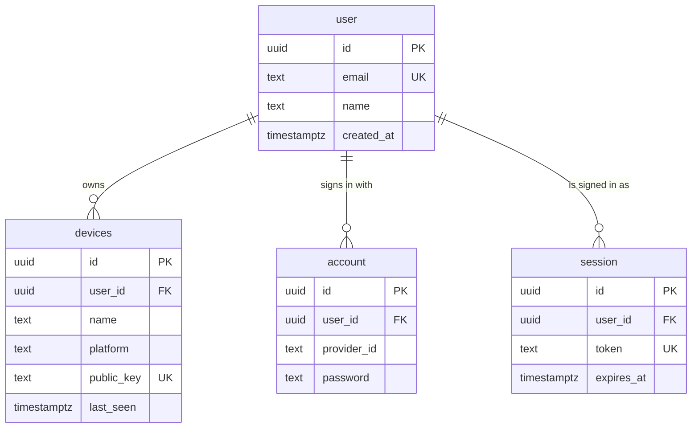

# FuseOS — Database Schema

**Engine:** PostgreSQL · **ORM:** Drizzle · **Auth tables:** Better Auth

The database is the **source of truth for identity only** — users and their devices. It **never** stores clipboard or file payloads; those are ephemeral and LAN-only. Integrity is enforced in the schema itself (NOT NULL, FK, UNIQUE, CHECK) so bad data cannot land even if application code has a bug.

Design goals: deliberate up-front modeling, additive/backward-compatible migrations only, constraints over conventions.

---

## Entity overview

## Tables

### Identity — `user`, `account`, `session`, `verification` (Better Auth)
Identity is owned by **Better Auth** (`server/src/auth/auth.ts`) through its Drizzle adapter; the tables are declared in `server/src/db/schema.ts` with Better Auth's column names, UUID ids (`generateId: 'uuid'`), and the constraints below added by us. We do **not** hand-roll password storage — Better Auth owns credentials and sessions. FuseOS tables reference `user.id`.

| Table | Holds | Constraints we add |
| --- | --- | --- |
| `user` | `id`, `name`, `email`, `email_verified`, `image`, timestamps | `email` UNIQUE and lower-case (CHECK), `name` 1–100 chars (CHECK) |
| `account` | one row per sign-in method; email/password is `provider_id = 'credential'` with the hash in `password` | FK `user_id → user(id)` ON DELETE CASCADE, indexed |
| `session` | one row per signed-in device: opaque `token`, `expires_at` (90 days, extended daily with use) | `token` UNIQUE, FK `user_id → user(id)` ON DELETE CASCADE, indexed |
| `verification` | short-lived values (email verification, password reset) | — |

**Migrated accounts.** Accounts from the dev-auth stand-in were carried over in migration `0003` with their ids, so their devices stayed attached. Their scrypt hash moved into `account.password` as `legacy-scrypt:<salt>:<hash>`, which `verifyAnyPassword` still accepts; it is replaced by Better Auth's own format the next time the password changes. Their sessions were not carried — each device signed in once more. `0004` dropped `dev_auth_users` and `dev_auth_sessions`.

### `devices`
One row per registered device. A user has 2–3 in v1.

| Column | Type | Constraints |
| --- | --- | --- |
| `id` | uuid | PK, default `gen_random_uuid()` |
| `user_id` | uuid | NOT NULL, FK → users(id) ON DELETE CASCADE |
| `name` | text | NOT NULL, CHECK (`length(name) between 1 and 100`) |
| `platform` | text | NOT NULL, CHECK (`platform in ('android','macos')`) |
| `public_key` | text | NOT NULL, UNIQUE |
| `battery` | int | nullable, CHECK (`battery is null or battery between 0 and 100`) — presence metadata, never payload |
| `last_seen` | timestamptz | nullable |
| `created_at` | timestamptz | NOT NULL, default `now()` |

Indexes: `(user_id)` for registry listing.

## What is deliberately NOT here

- **No `device_trust` table and no `pairing_codes` table.** Two devices are trusted
  because they share a `user_id` — the sign-in already established that, so there is
  nothing to persist at link time and no code to issue or expire. `trustedPeerIds`
  (`server/src/devices/trust.ts`) is the whole of it. Both tables existed until migration
  `0002`, which drops them. The manual-link code that came back afterwards lives in memory
  on the server — it is meaningless five minutes after it is issued, so it never earns a
  row.
- **No `clipboard_events` table. No `files` table.** Clipboard content and files are ephemeral and travel LAN-direct (see [protocol.md](protocol.md)). Storing them would violate the latency and privacy invariants and put user payloads in the DB.
- No analytics/event log of payloads.

## Migrations

- Generated with Drizzle (`pnpm db:generate`), applied with `pnpm db:migrate`.
- **Additive first:** new nullable columns, new tables, new indexes are safe. Renames/drops require a real reason and a backfill plan.
- Constraints ship *with* the table that needs them — never rely on application logic for an invariant a CHECK/FK/UNIQUE can guarantee.
